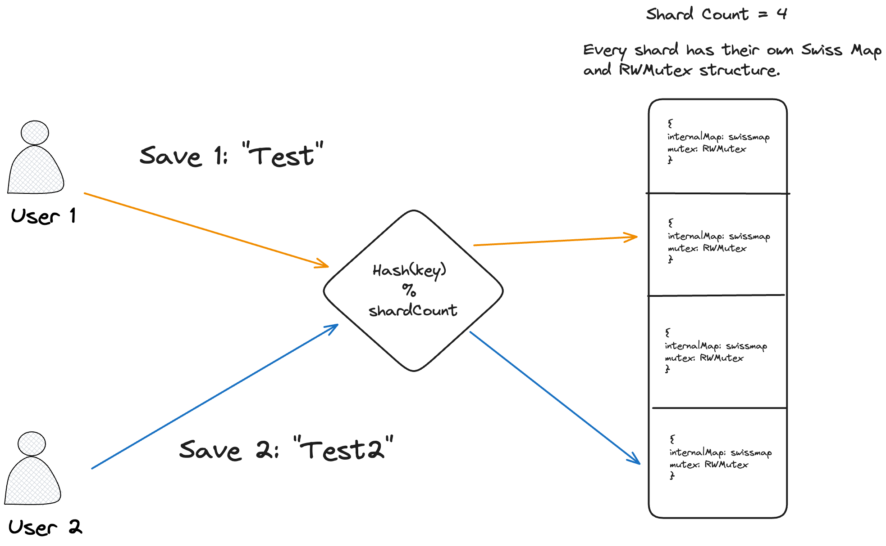
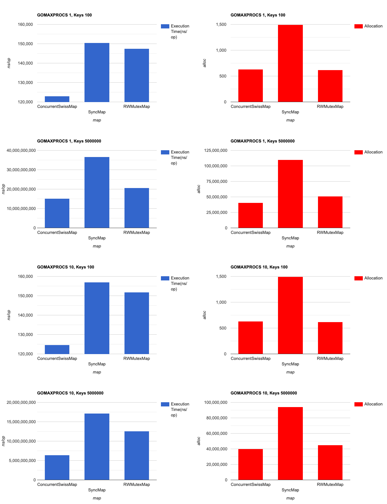

# Concurrent Swiss Map [![GoDoc][doc-img]][doc] [![Build Status][ci-img]][ci] [![Coverage Status][cov-img]][cov] [![Go Report Card][go-report-img]][go-report]

**Concurrent Swiss Map** is an open-source Go library that provides a high-performance, thread-safe generic concurrent hash map implementation designed to handle concurrent access efficiently. It's built with a focus on simplicity, speed, and reliability, making it a solid choice for scenarios where concurrent access to a hash map is crucial.

Uses [dolthub/swiss](https://github.com/dolthub/swiss) map implementation under the hood.

## Installation

Supports 1.18+ Go versions because of Go Generics

```
go get github.com/mhmtszr/concurrent-swiss-map
```

## Usage

New functions will be added soon...

```go
package main

import (
	"hash/fnv"

	csmap "github.com/mhmtszr/concurrent-swiss-map"
)

func main() {
	myMap := csmap.New[string, int](
		// set the number of map shards. the default value is 32.
		csmap.WithShardCount[string, int](32),

		// if don't set custom hasher, use the built-in maphash.
		csmap.WithCustomHasher[string, int](func(key string) uint64 {
			hash := fnv.New64a()
			hash.Write([]byte(key))
			return hash.Sum64()
		}),

		// set the total capacity, every shard map has total capacity/shard count capacity. the default value is 0.
		csmap.WithSize[string, int](1000),
	)

	key := "swiss-map"
	myMap.Store(key, 10)

	val, ok := myMap.Load(key)
	println("load val:", val, "exists:", ok)

	deleted := myMap.Delete(key)
	println("deleted:", deleted)

	ok = myMap.Has(key)
	println("has:", ok)

	empty := myMap.IsEmpty()
	println("empty:", empty)

	myMap.SetIfAbsent(key, 11)

	myMap.Range(func(key string, value int) (stop bool) {
		println("range:", key, value)
		return true
	})

	count := myMap.Count()
	println("count:", count)

	// Output:
	// load val: 10 exists: true
	// deleted: true
	// has: false
	// empty: true
	// range: swiss-map 11
	// count: 1
}
```

## Basic Architecture


## Benchmark Test
Benchmark was made on:
- Apple M1 Max
- 32 GB memory

Benchmark test results can be obtained by running [this file](concurrent_swiss_map_benchmark_test.go) on local computers.



### Benchmark Results

- Memory usage of the concurrent swiss map is better than other map implementations in all checked test scenarios.
- In high concurrent systems, the concurrent swiss map is faster, but in systems containing few concurrent operations, it works similarly to RWMutexMap.

[doc-img]: https://godoc.org/github.com/mhmtszr/concurrent-swiss-map?status.svg
[doc]: https://godoc.org/github.com/mhmtszr/concurrent-swiss-map
[ci-img]: https://github.com/mhmtszr/concurrent-swiss-map/actions/workflows/build-test.yml/badge.svg
[ci]: https://github.com/mhmtszr/concurrent-swiss-map/actions/workflows/build-test.yml
[cov-img]: https://codecov.io/gh/mhmtszr/concurrent-swiss-map/branch/master/graph/badge.svg
[cov]: https://codecov.io/gh/mhmtszr/concurrent-swiss-map
[go-report-img]: https://goreportcard.com/badge/github.com/mhmtszr/concurrent-swiss-map
[go-report]: https://goreportcard.com/report/github.com/mhmtszr/concurrent-swiss-map